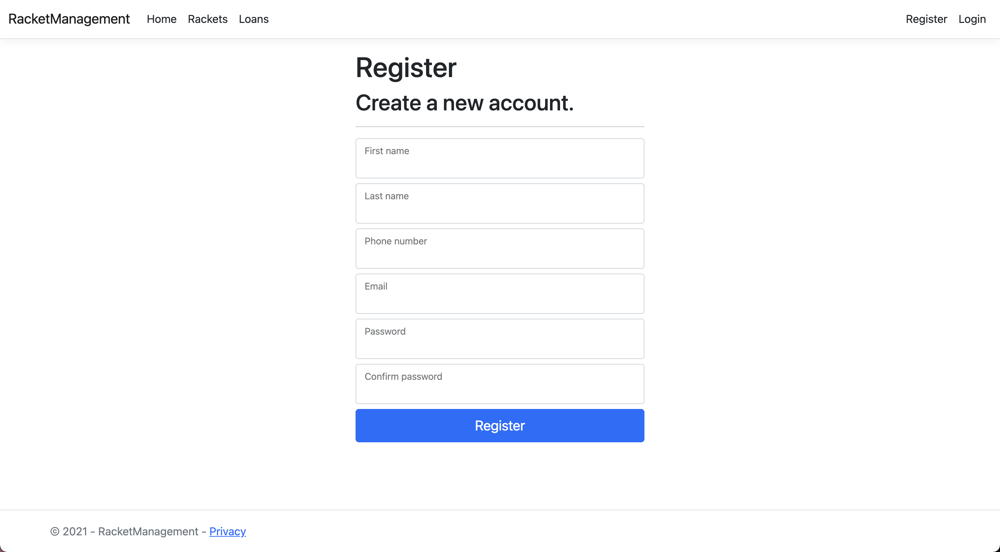

# RacketManagement
Sistem za izposojo loparjev

## Authors
Jaša Jovan 63200123

## Problem
Trenutno opravljam študentsko delo v trgovini specializirani za športe z loparji(tenis, badminton, squash, padel, crossminton, namizni tenis), kjer tudi loparje dajemo v izposojo za testiranje in trenutno, ko si nekdo pride izposoditi lopar vnašamo vse podatke v excel tabelo. Problem trenutne metode je, da se vsake toliko časa pozabi osebo kontaktirati v primeru, da zamuja ali podobno.

## Rešitev
Informacijski sistem **RacketManagement** zgornji problem reši tako, da si stranke vnaprej lopar rezervirajo na spletni strani.
Sistem bo omogočal pregled, dodajanje, brisanja loparjev(določene loparjev imamo za odkup). Nov lopar se doda tako, da na iz nabora znamk, modelov in velikosti gripov naredimo nov lopar. Dodamo lahko tudi nove znamke, modele in velikosti gripov. Stranke vidijo samo svoje rezervacije in loparje, ki trenutno niso izposojeni

